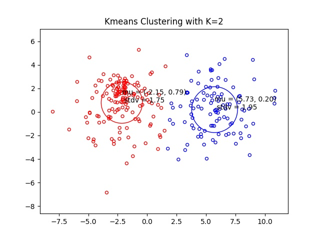
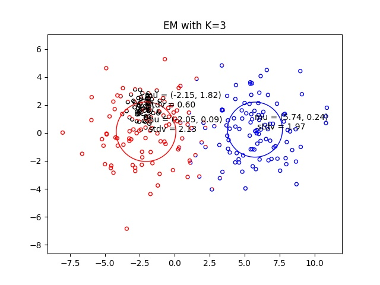

<div id="top"></div>

[![Contributors][contributors-shield]][contributors-url]
[![Forks][forks-shield]][forks-url]
[![Stargazers][stars-shield]][stars-url]
[![Issues][issues-shield]][issues-url]
[![MIT License][license-shield]][license-url]
[![LinkedIn][linkedin-shield]][linkedin-url]

<!-- PROJECT LOGO -->
<br />
<div align="center">
  <a href="https://github.com/Magician6174/Naive_EM">
    
  </a>

<h3 align="center">Clustering Algorithm</h3>

  <p align="center">
    Clustering Algorithm using Kmeans & EM Gaussian Mixture Model.
    <br />
    <a href="https://github.com/Magician6174/Naive_EM"><strong>Explore the docs »</strong></a>
    <br />
    <br />
    <a href="https://github.com/Magician6174/Naive_EM">View Demo</a>
    ·
    <a href="https://github.com/Magician6174/Naive_EM/issues">Report Bug</a>
    ·
    <a href="https://github.com/Magician6174/Naive_EM/issues">Request Feature</a>
  </p>
</div>

> Clustering Algorithm for 2d dataset.

> Clustering Algorithms, EM Algorithm, Kmeans Algorithm


<!-- TABLE OF CONTENTS -->
<details>
  <summary>Table of Contents</summary>
  <ol>
    <li>
      <a href="#about-the-project">About The Project</a>
      <ul>
        <li><a href="#built-with">Built With</a></li>
      </ul>
    </li>
    <li>
      <a href="#getting-started">Getting Started</a>
      <ul>
        <li><a href="#how-to-run">How to run</a></li>
        <!-- <li><a href="#installation">Installation</a></li> -->
      </ul>
    </li>
    <li><a href="#results">Results</a></li>
    <li><a href="#contributing">Contributing</a></li>
    <li><a href="#license">License</a></li>
    <li><a href="#contact">Contact</a></li>
    <li><a href="#acknowledgments">Acknowledgments</a></li>
  </ol>
</details>

<!-- ABOUT THE PROJECT -->
## About The Project

<!-- [![Product Name Screen Shot][product-screenshot]](https://example.com) -->

In this project we will compare clustering obtained via K-means to the (soft) clustering induced by EM. 


### Built With
This project was built with 

* Python 3.8.10
* [Numpy](https://numpy.org/)
* [Matplotlib](https://matplotlib.org/)


<!-- GETTING STARTED -->
## Getting Started

This is an example of how you may give instructions on setting up your project locally.
To get a local copy up and running follow these simple example steps.


Clone the repository into a local machine using
```shell
git clone https://github.com/Magician6174/bleh-ble-bleh
```
### How to run

* For kmeans algorithm run
  ```sh
  python kmeans_main.py
  ```
  When you run the above command a random value for K and seed will be chosen. And the results are plotted.

* For EM Algorithm run
  ```sh
  python em_main.py
  ```
  In EM you can chose between with_bic & without_bic by making ```WITH_BIC = True or False```. BIC is Bayesian Information Criterion for model selection.

<!-- ### Prerequisites

This is an example of how to list things you need to use the software and how to install them.
* pip
  ```sh
  pip install ...
* Create a new conda environment and install all the libraries by running the following command

  ```shell
  conda env create -f environment.yml
  ``` 
* The dataset used in this project is available on ...

### Installation

1. Step 1
2. Step 2
3. ...
4. ... -->

## Results

Below is the output for Kmeans and EM Algorithm for 2d Dataset.

|       KMeans Algorithm                      |       EM Algorithm                          |
| :-----------------------------------------: | :-----------------------------------------: |
|                    |                        |

<!-- ROADMAP -->
<!-- ## Roadmap

- [x] Add Changelog
- [x] Add back to top links
- [ ] Add Additional Templates w/ Examples
- [ ] Add "components" document to easily copy & paste sections of the readme
- [ ] Multi-language Support
    - [ ] Hindi
    - [ ] English
    - [ ] Spanish

See the [open issues](https://github.com/Magician6174/Naive_EM/issues) for a full list of proposed features (and known issues). -->

<!-- CONTRIBUTING -->
## Contributing

Contributions are what make the open source community such an amazing place to learn, inspire, and create. Any contributions you make are **greatly appreciated**.

If you have a suggestion that would make this better, please fork the repo and create a pull request. You can also simply open an issue with the tag "enhancement".
Don't forget to give the project a star! Thanks again!

1. Fork the Project
2. Create your Feature Branch (`git checkout -b feature/AmazingFeature`)
3. Commit your Changes (`git commit -m 'Add some AmazingFeature'`)
4. Push to the Branch (`git push origin feature/AmazingFeature`)
5. Open a Pull Request

<!-- LICENSE -->
## License

Distributed under the MIT License. See `LICENSE.txt` for more information.

<!-- CONTACT -->
## Contact

Magician6174 - [My Email](mailto:himanshumagician@gmail.com)

Project Link: [Naive_EM](https://github.com/Magician6174/Naive_EM)

<!-- ACKNOWLEDGMENTS -->
## Acknowledgments

* [Machine Learning](https://ocw.mit.edu/courses/electrical-engineering-and-computer-science/6-867-machine-learning-fall-2006/lecture-notes/lec16.pdf)
* [GMM & EM Algorithm](https://people.csail.mit.edu/rameshvs/content/gmm-em.pdf)


 
<p align="right">(<a href="#top">back to top</a>)</p>


[contributors-shield]: https://img.shields.io/github/contributors/Magician6174/Naive_EM.svg?label=CONTRIBUTORS&logo=github&style=flat-square
[contributors-url]: https://github.com/Magician6174/Naive_EM/graphs/contributors
[forks-shield]: https://img.shields.io/github/forks/Magician6174/Naive_EM.svg?label=FORKS&logo=GITHUB&style=flat-square
[forks-url]: https://github.com/Magician6174/Naive_EM/network/members
[stars-shield]: https://img.shields.io/github/stars/Magician6174/Naive_EM.svg?label=STARS&logo=github&style=flat-square
[stars-url]: https://github.com/Magician6174/Naive_EM/stargazers
[issues-shield]: https://img.shields.io/github/issues/Magician6174/Naive_EM.svg?label=ISSUES&logo=GITHUB&style=flat-square
[issues-url]: https://github.com/Magician6174/Naive_EM/issues
[license-shield]: https://img.shields.io/github/license/Magician6174/Naive_EM.svg?label=LICENSE&logo=github
[license-url]: https://github.com/Magician6174/Naive_EM/blob/master/LICENSE
[linkedin-shield]: https://img.shields.io/badge/-LinkedIn-black.svg?style=flat-square&logo=linkedin&colorB=555
[linkedin-url]: https://www.linkedin.com/in/himanshu-sharma-39689b205/
<!-- [product-screenshot]: images/screenshot.png -->
